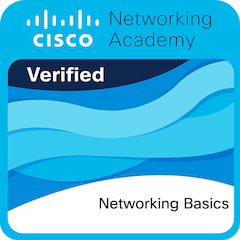

# 🏆 Certifications & Digital Badges

Click on any badge to verify it on Credly.

| Badge | Certification | Issued By | Verification |
| :---: | --- | --- | :---: |
|  | Kubernetes and Cloud Native Associate (KCNA) | The Linux Foundation | <a href="https://www.credly.com/badges/db1ec37d-40f8-4fc6-986a-c94d8b686771/public_url">[View Badge]</a> |
|  | AWS Certified Cloud Practitioner | Amazon  | <a href="https://www.credly.com/badges/cd603e42-bf11-477a-8114-daf292ff0a7d/public_url">[View Badge]</a> |
|   | AWS Knowledge: Migration Foundations - Training Badge | Amazon | <a href="https://www.credly.com/badges/54bcccb3-baf0-487b-8492-617b57bf368c/public_url">[View Badge]</a> |
|  | Networking Basics | Cisco | <a href="https://www.credly.com/badges/4f76e825-3042-4e90-b1c1-a99e2b15faa9/public_url">[View Badge]</a> |
|  | HTML Essentials | Cisco | <a href="[https://www.credly.com/badges/35ae3591-1d4a-4e61-a7a3-9a1903b1c9f5/public_url](https://www.credly.com/badges/35ae3591-1d4a-4e61-a7a3-9a1903b1c9f5/public_url)">[View Badge]</a> |
